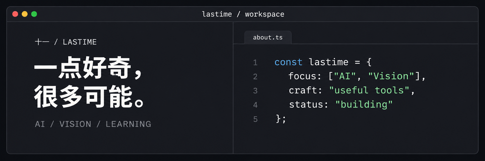
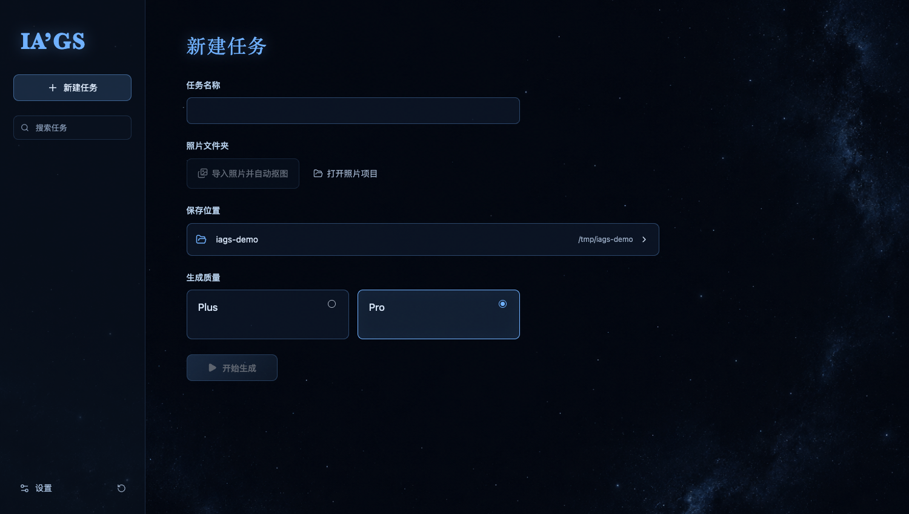
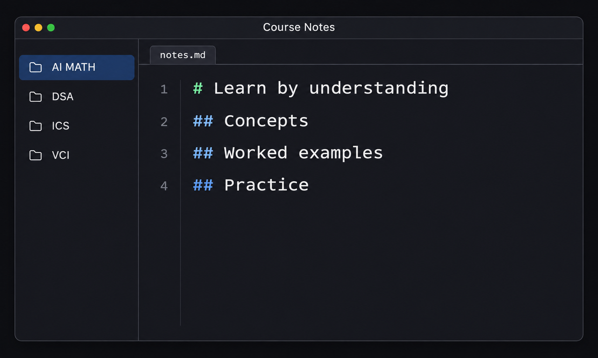
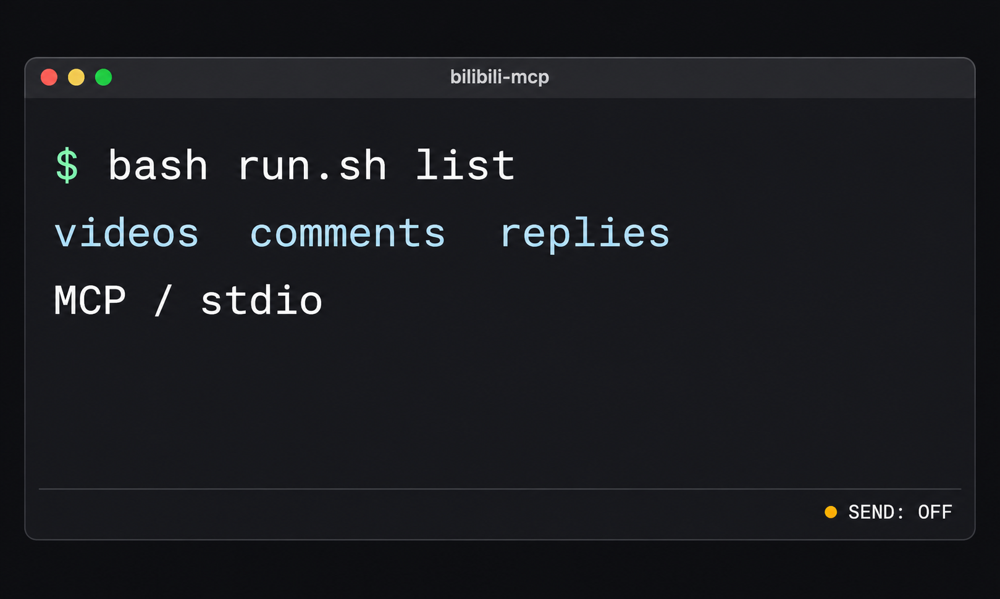
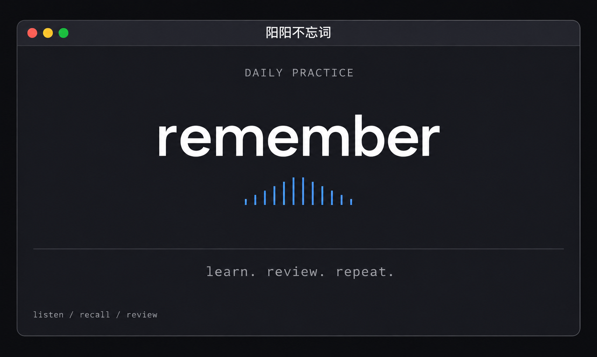
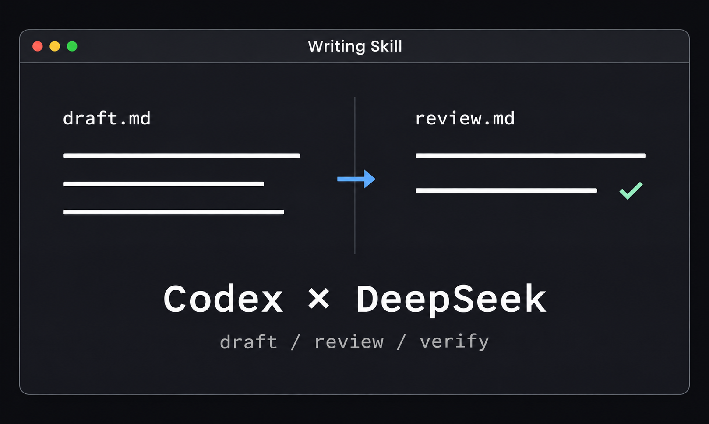
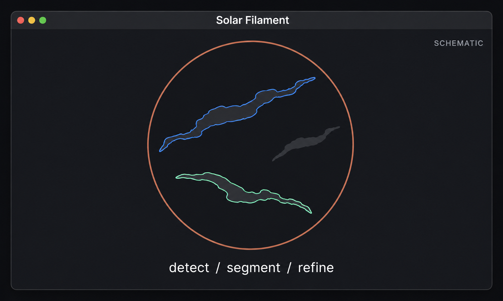
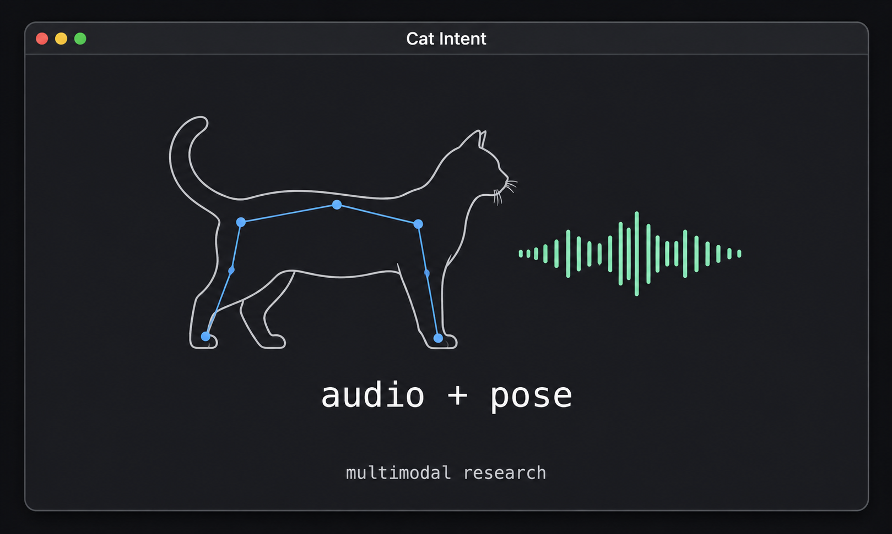
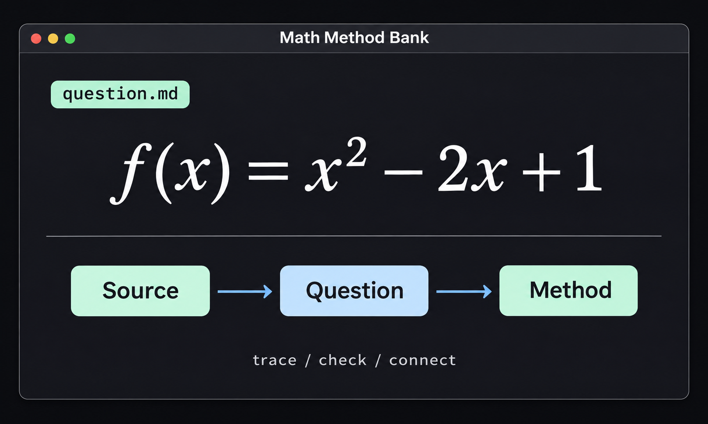
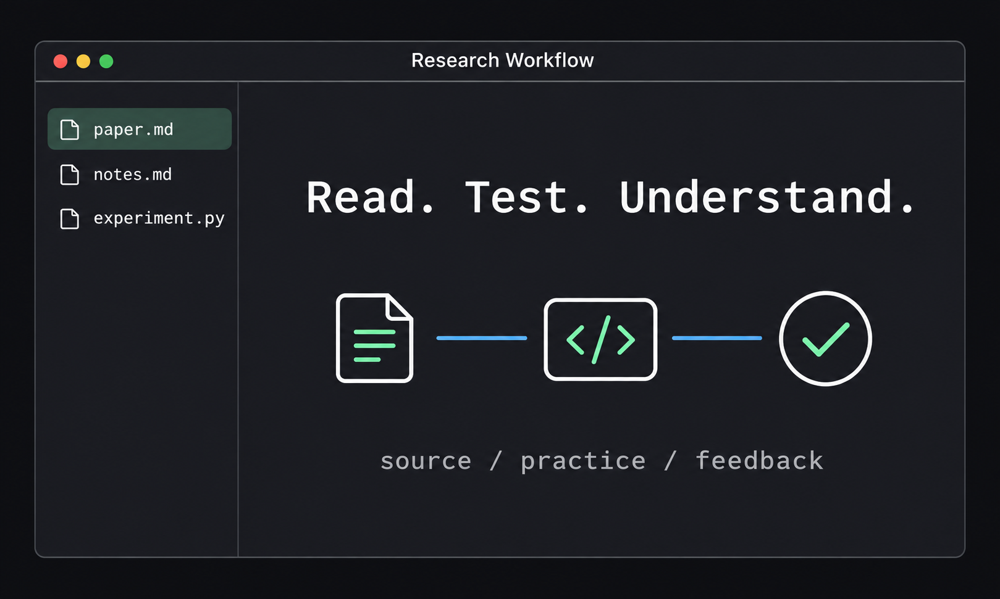

  

  <a href="#user-content-精选项目">项目</a> &nbsp; / &nbsp;
  <a href="#user-content-课程笔记">笔记</a> &nbsp; / &nbsp;
  <a href="#user-content-正在探索">研究</a> &nbsp; / &nbsp;
  <a href="#user-content-工具箱">工具</a>

 

### 你好，我是十一。

我关注 **AI 应用、计算机视觉与研究工具**。喜欢把实际问题写成代码，也把学习中的推导、练习和疑问认真整理下来。

这里放着我在做的工具、公开的课程笔记，以及还在探索中的课题。

 

## 精选项目

SELECTED WORK / 01—09

 

<table>
  <tr>
    <td width="33%" valign="top">
      
      
<strong>01 / IA’GS</strong> macOS 测试版

      
本地照片转 3D 高斯，支持预览与导出。

      <a href="https://github.com/by-lastime/IA-GS">源码 ↗</a> · <a href="https://github.com/by-lastime/IA-GS/releases/tag/v0.1.0">下载</a>
    </td>
    <td width="33%" valign="top">
      
      
<strong>02 / 课程笔记</strong> 4 门课程 · 持续更新

      
AI 数学、数算、计算机系统与可视计算。

      <a href="#user-content-课程笔记">课程目录 ↗</a>
    </td>
    <td width="33%" valign="top">
      
      
<strong>03 / B 站 MCP</strong> 默认关闭发送

      
视频与评论读取、巡检恢复、回复防重。

      <a href="https://github.com/by-lastime/dot-bilibili-mcp">源码 ↗</a>
    </td>
  </tr>
  <tr>
    <td width="33%" valign="top">
      
      
<strong>04 / 阳阳不忘词</strong> 源码私有 · 准备上线

      
小组词汇打卡、美音、复习与错词回看。

      <a href="https://github.com/by-lastime/yangyang-vocabulary-showcase">产品介绍 ↗</a>
    </td>
    <td width="33%" valign="top">
      
      
<strong>05 / 写作 Skill</strong> Codex × DeepSeek

      
协作起草、评改、表达检查与引文核验。

      <a href="https://github.com/by-lastime/codex-deepseek-skills">查看技能 ↗</a>
    </td>
    <td width="33%" valign="top">
      
      
<strong>06 / 太阳暗条</strong> 研究展示

      
太阳暗条实例分割、候选分析与局部细化。

      <a href="https://github.com/by-lastime/solar-filament-showcase">研究介绍 ↗</a>
    </td>
  </tr>
  <tr>
    <td width="33%" valign="top">
      
      
<strong>07 / 猫类意图识别</strong> 研究进行中

      
结合音频、姿态与多模态融合探索猫类意图。

      <a href="#user-content-猫类意图识别">研究进展 ↗</a>
    </td>
    <td width="33%" valign="top">
      
      
<strong>08 / 高中数学题库</strong> 源码与完整数据私有

      
关联题目、来源、知识点与具体解题方法。

      <a href="https://github.com/by-lastime/math-bank-showcase">项目介绍 ↗</a>
    </td>
    <td width="33%" valign="top">
      
      
<strong>09 / 科研工作流</strong> MIT 开源

      
从论文精读到讲义、教学实验与作答反馈。

      <a href="https://github.com/by-lastime/research-learning-workflow">查看源码 ↗</a>
    </td>
  </tr>
</table>

IA’GS 为实际应用截图，基于 OOOSplat，保留上游与第三方声明；其余配图为 AI 生成的概念视觉。

  

## 课程笔记

OPEN NOTEBOOK / 全部公开课程

从概念、推导到独立练习。四门课程均提供在线阅读与 PDF，源稿和修订记录保存在对应仓库中。

#### AI 数学 · AI MATH

概率与随机变量相关复习讲义，含 **41 个讲次**、来源题集与补充问答。

[在线阅读 ↗](https://by-lastime.github.io/ai-math-study-notes/) &nbsp; · &nbsp; [讲义与 PDF](https://github.com/by-lastime/ai-math-study-notes)

#### 数据结构与算法 · DSA

**六章精讲**，配套题型训练、模拟卷、独立解析与补充问答。

[在线阅读 ↗](https://by-lastime.github.io/dsa-study-notes/) &nbsp; · &nbsp; [讲义与 PDF](https://github.com/by-lastime/dsa-study-notes)

#### 计算机系统 · ICS

整数、浮点、汇编、过程调用、数据布局与内存安全；包含图解、练习与答案。

[在线阅读 ↗](https://by-lastime.github.io/ics-study-notes/) &nbsp; · &nbsp; [讲义与 PDF](https://github.com/by-lastime/ics-study-notes)

#### 可视计算与交互 · VCI

颜色、图像处理、光栅化、曲线与采样，配套真题参考解析、独立自测与补充问答。

[在线阅读 ↗](https://by-lastime.github.io/vci-study-notes/) &nbsp; · &nbsp; [讲义与 PDF](https://github.com/by-lastime/vci-study-notes)

按当前学习阶段持续更新，具体覆盖范围见各仓库。原始教材与完整课件不随公开版分发。

  

## 正在探索

RESEARCH LOG / 持续推进中的问题

#### 猫类意图识别

从音频、姿态与多模态融合探索猫类意图。负责课题定义、技术路线、数据与标签方案；已获学院“创新+”工作站立项，进入数据整理与 baseline 实验阶段。

#### 太阳暗条实例分割

面向 2026 挑战赛的 Hα 图像实例分割研究。已开展多轮基线、分辨率消融、候选误差分析与局部细化，继续补充形态评价和研究文稿。[研究介绍 ↗](https://github.com/by-lastime/solar-filament-showcase)

#### 跨语言提示与中国形象表征

研究不同语言提示下的视觉表征差异与传播偏差，结合多模态主题编码、人工核验、计算美学与统计比较。

  
课程与团队协作 · 麻将 AI / 校园 Agent

  
<strong>Botzone 国标麻将 AI</strong> · 参与策略训练与评测设计，结合 MultiTask ResCNN、合法动作重排和本地 arena，比较训练策略并分析评测环境差异。

  
<strong>PKU-Captain 校园 Agent</strong> · 三人团队项目，参与 PyQt6 GUI 与系统集成，连接校园信息、工具、记忆与文档检索，形成可运行桌面原型。

  

## 工具箱

TOOLS & STACK / 工作台上的其他东西

- **[Codex 中文写作 Skills](https://github.com/by-lastime/codex-deepseek-skills)** — 从材料与论证到起草、评改、表达检查和独立引文核验；需本地环境。
- **[论文双语阅读器](https://github.com/by-lastime/bilingual-paper-reader)** — 中英段落对照、原 PDF 定位与长期保留的问答批注。
- **[研究学习工作流](https://github.com/by-lastime/research-learning-workflow)** — 论文精读、主题讲义、教学实验与来源核验。
- **[数学知识与方法题库](https://github.com/by-lastime/math-bank-showcase)** — 关联来源、题目、知识点与解题步骤；公开项目介绍，源码与完整数据私有。

 

**模型与数据** &nbsp; `Python` `PyTorch` `计算机视觉` `多模态分析` 
**产品与界面** &nbsp; `JavaScript / TypeScript` `React` `PyQt6` `Rust / Tauri` 
**服务与协作** &nbsp; `FastAPI` `Node.js` `SQL` `Git / GitHub`

 

---

  <code>// keep learning. keep building.</code>
    
  <a href="https://github.com/by-lastime?tab=repositories">浏览全部仓库</a> &nbsp; · &nbsp;
  <a href="https://lastime-little-space.fun-root-1056.chatgpt.site">到我的个人空间坐坐 ↗</a>

